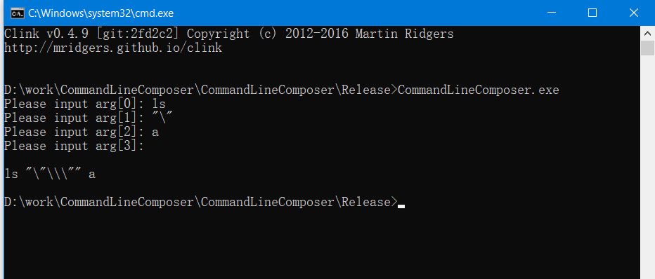

# Win32-CommandLineComposer README

A simple Win32 command line tool that receives a series of arguments and
outputs valid and escaped command line.

## Usage

Leave the next input past the last argument blank.

## Reference

[Everyone quotes command line arguments the wrong way](https://docs.microsoft.com/en-us/archive/blogs/twistylittlepassagesallalike/everyone-quotes-command-line-arguments-the-wrong-way)